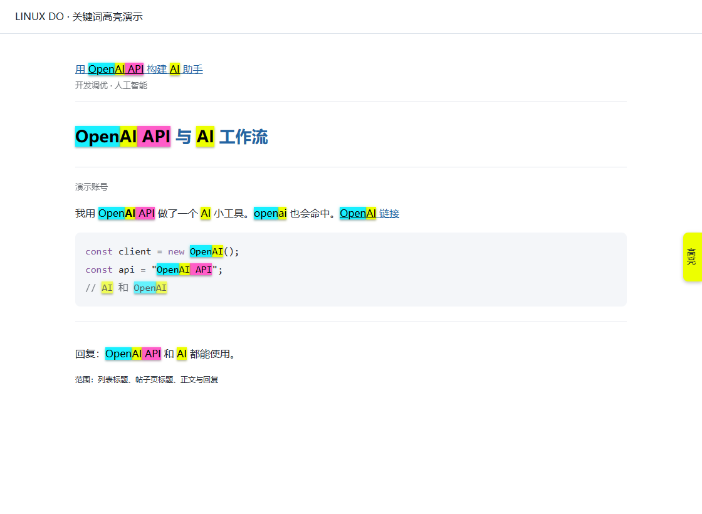
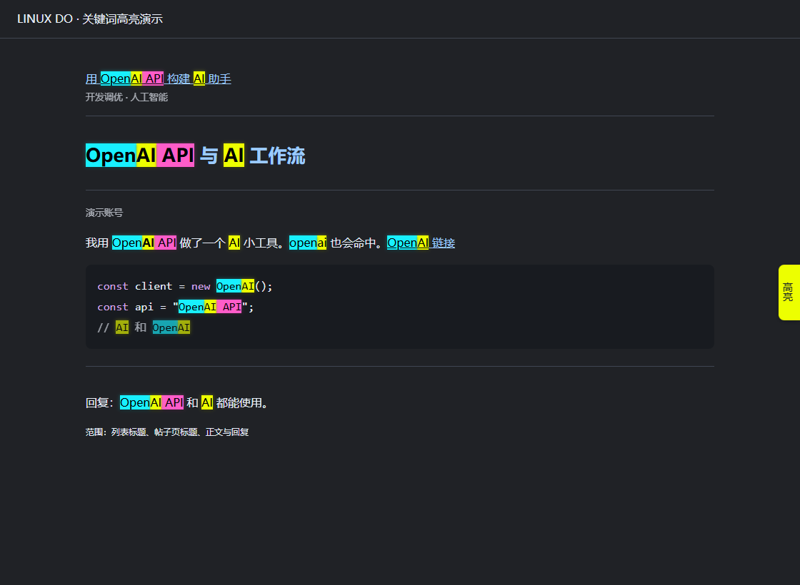
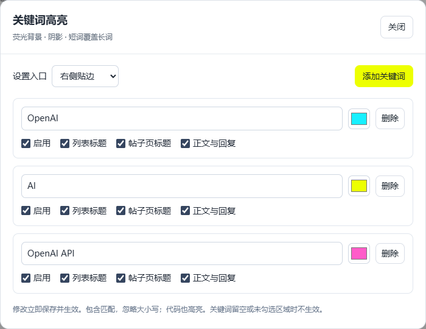

# Linux.do 荧光关键词高亮

在 [Linux.do](https://linux.do/) 上，把你关心的词标出来。刷列表能看到，进帖子后标题、正文和回复也能继续高亮。

**[安装脚本](https://raw.githubusercontent.com/kai-wei-kfuse/linuxdo-keyword-highlighter/master/linuxdo-keyword-highlighter.user.js)** · [查看源码](linuxdo-keyword-highlighter.user.js) · [反馈问题](https://github.com/kai-wei-kfuse/linuxdo-keyword-highlighter/issues)

适用：电脑端 Chrome / Edge + Tampermonkey。

## 能做什么

- 每个关键词单独选颜色，默认是荧光色，高亮块带一点阴影。
- 列表标题、帖子页标题、正文与回复分别勾选。比如一个词只看标题，另一个词只看正文。
- 关键词重叠时，短词覆盖长词。
- 行内代码、代码块和链接文字也能高亮。复制时还是原文。
- 设置入口可以放左边、右边，或切成可拖动的小浮窗；位置会记住。修改立即保存并生效。

## 效果

下面是脚本在演示页面中的截图，使用了 `OpenAI`、`AI` 和 `OpenAI API` 三条规则。



<details>
<summary>看一下深色背景下的效果</summary>



</details>

## 安装

1. 先装好 [Tampermonkey](https://www.tampermonkey.net/)，并启用扩展。
2. 点击上面的 **安装脚本**，在油猴弹出的页面里点「安装」。
3. 打开或刷新 Linux.do，点击右侧边缘的「高亮」标签。

没有弹出安装页的话，打开 [脚本源码](linuxdo-keyword-highlighter.user.js)，复制全部内容。然后在 Tampermonkey 里「添加新脚本」，删掉默认模板，粘贴并保存。

如果浏览器提示需要「允许运行用户脚本」，按 Tampermonkey 的提示开启即可。

## 怎么设置

第一次安装是空词库。点「添加关键词」，填入想关注的词，选一个背景色，再勾选它要出现的区域。



| 区域 | 高亮哪里 |
| --- | --- |
| 列表标题 | 帖子列表里的标题文字 |
| 帖子页标题 | 进入帖子后顶部的标题 |
| 正文与回复 | 楼主正文和其他人的回复，包括代码 |

一个词可以添加多条规则，用在不同区域时选不同颜色。暂时不用的规则取消「启用」就行；关键词留空或三个区域都没勾选时，也不会参与高亮。

设置入口默认贴在右边。面板里的「设置入口」可以切换为左侧贴边、右侧贴边或可拖动浮窗。浮窗直接拖到想放的位置，刷新后位置仍会保留。

### 匹配怎么处理

用的是**包含匹配，忽略大小写**：`AI` 能命中 `OpenAI` 里的 `AI`，也能命中小写 `ai`。`C++`、`[AI]` 这类带符号的词，按你输入的文字匹配。

重叠时短词优先。例如同时设置：

| 关键词 | 背景色 |
| --- | --- |
| `OpenAI API` | 粉色 |
| `OpenAI` | 青色 |
| `AI` | 黄色 |

遇到 `OpenAI API` 时，`Open` 是青色，`AI` 是黄色，后面的 ` API` 是粉色。长度相同的词发生重叠，则先添加的规则优先。

### 配置保存在哪

配置存在 Tampermonkey 的脚本存储里。改词、换色、勾选区域都会立即保存，同一浏览器其他标签页里的配置也会同步。没有导入、导出功能。

脚本只在 `https://linux.do/*` 运行，不上传关键词或页面内容，也不会自己发起网络请求。

## 开发与测试

安装直接使用 `.user.js` 文件即可。开发测试需要 Node.js 24，以及本机安装的 Chrome 和 Edge。

```sh
npm install
npm test
npm run check
npm run test:browser
```

单元测试检查匹配、重叠优先级和配置校验，硬超时为 60 秒。浏览器测试检查即时保存、动态回复、代码滚动、浮窗拖动等行为。测试中的油猴存储使用独立适配器，不会改动你安装的脚本配置。

线上页面检查单独运行：

```sh
npm run test:live
```

它只读取公开页面，不登录或发帖。结果和截图保存在 `test-results/`，失败时也会留下页面状态。

当前 12 项单元测试、语法检查和 Chrome / Edge 交互测试已通过，真实 Linux.do 页面的区域结构也已核对。线上自动化高亮检查被 Cloudflare 403 验证页拦住，还没跑完；真实 Tampermonkey 扩展中的安装和存储也尚未验证。

实现使用 [CSS Custom Highlight API](https://developer.mozilla.org/en-US/docs/Web/API/CSS_Custom_Highlight_API)，保留网站原有文字节点；阴影由单独的装饰层绘制。需要支持该 API 的 Chrome / Edge，老版本浏览器请先更新。

遇到问题可以提 [Issue](https://github.com/kai-wei-kfuse/linuxdo-keyword-highlighter/issues)，带上浏览器和 Tampermonkey 版本、复现步骤，以及方便的话一张截图。
